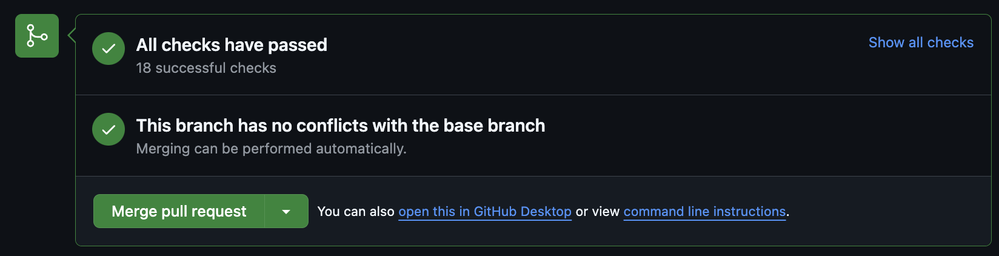
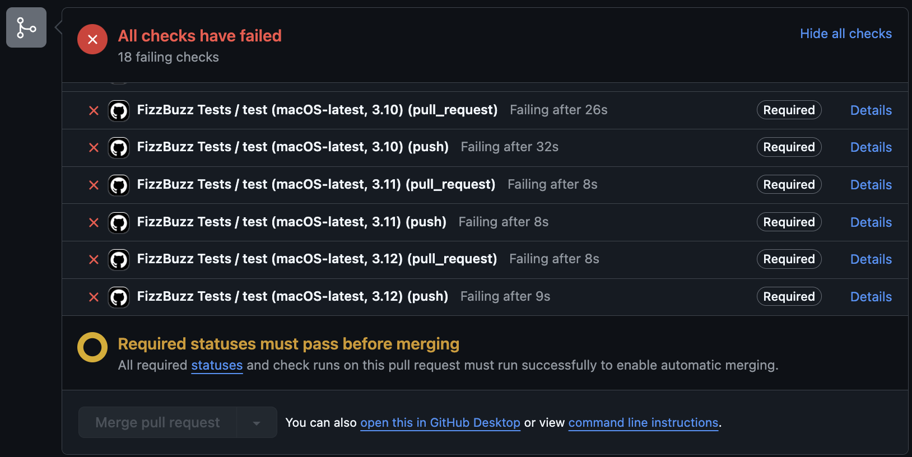
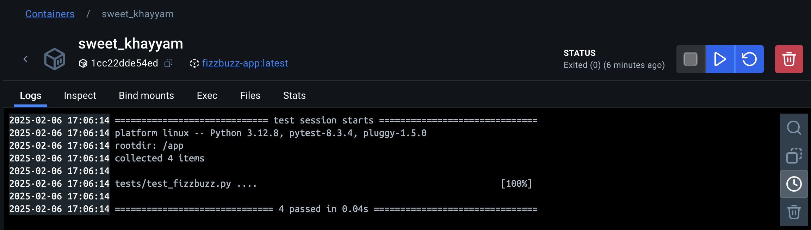

**Code coverage avec CODECOV**<br>

Pour plus de détails sur notre couverture de tests, consultez [notre rapport complet sur Codecov](https://app.codecov.io/gh/NoamXD8/fizzbuzz-Efrei_noam).


### 1. Installer `coverage`

Si ce n'est pas déjà fait, installez le module `coverage` avec la commande suivante :

```bash
pip install coverage
```

### 2. Lancer les tests avec `coverage`

Pour exécuter les tests tout en mesurant la couverture, lancez la commande suivante :

```bash
coverage run -m pytest
```

### 3. Voir le rapport de couverture

Après l'exécution des tests, générez un rapport de couverture avec la commande suivante :

```bash
coverage report -m
```

### Exemple de rapport de couverture

Voici un exemple de à quoi ressemble le rapport de couverture du projet :

```bash
Name                     Stmts   Miss  Cover   Missing
------------------------------------------------------
fizzbuzz.py                 16      0   100%   
tests/test_fizzbuzz.py      24      0   100%   
------------------------------------------------------
TOTAL                       40      0   100%
```

### Sinon on peut utiliser :
```bash
coverage html
```
### Qui nous donne le lien suivant :
```bash
Wrote HTML report to htmlcov/index.html
```


Dans cet exemple, nous avons atteint une couverture de **100%**, ce qui signifie que tous les fichiers et tests sont couverts.

**🟢 Tests réussis : la PR peut être fusionnée**  


**🔴 Tests échoués : la PR est bloquée**  



**Run des tests dans Docker** :

